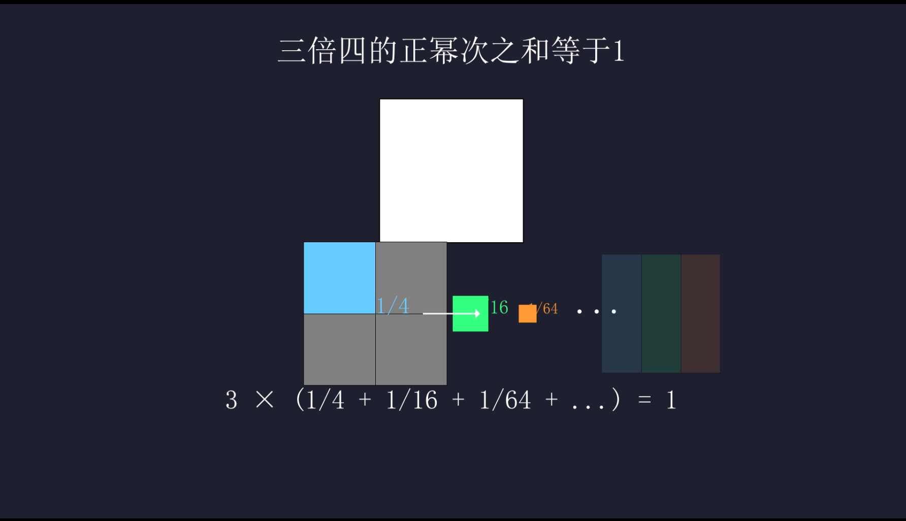

# After Effects MCP Integration 🚀


A powerful, extensible Model Context Protocol (MCP) integration for Adobe After Effects. This project enables AI assistants to directly interact with and control After Effects through a standardized interface.

## 📸 Screenshots

### After Effects Integration


### MCP Tool Inspector


### Claude Integration


## 🎬 Demo Video

Check out the demo video below to see the integration in action:


<!-- Method 2: Thumbnail with link to video -->
[](https://github.com/sunqirui1987/ae-mcp/raw/main/docs/数学形状演示.mp4 "Click to watch the demo")


## ✨ Features

- **Extensible Architecture**: Easily add new tools through configuration files
- **Rich After Effects Functionality**: Control compositions, layers, effects, and more
- **MCP Compliant**: Works with any MCP-compatible AI model, including Claude


## 🛠️ Tools

This integration provides a comprehensive set of tools for After Effects:

| Category | Capabilities |
|----------|-------------|
| **Project** | Get project information, list compositions, manage project properties |
| **Compositions** | Create new compositions with custom dimensions, frame rates, and durations |
| **Text Layers** | Add and modify text layers with font controls, tracking, justification, colors, and styling |
| **Solid Layers** | Create solid layers with custom colors, dimensions, and 3D properties |
| **Shape Layers** | Create custom and preset shape layers (rectangles, ellipses, polygons, stars) with full control over vertices, tangents, and feathering |
| **Layer Properties** | Set position, scale, rotation, opacity, and other transformation properties |
| **Effects** | Browse effect categories, view available effects with details (BPC support, GPU acceleration), and apply them to layers with customizable parameters |
| **Scripting** | Execute arbitrary ExtendScript code for advanced customization |
| **Manim Integration** | Create mathematical animations using Manim and import them as transparent WebP layers |

Each tool implements After Effects functionality via ExtendScript and exposes a clean Go API that follows the MCP specification.

## 🚀 Getting Started

### Prerequisites

- Adobe After Effects (CC 2020 or later recommended)
- Go/Go+ runtime (for the MCP server)
- Python 3.7+ and pip (for Manim)
- Basic knowledge of After Effects and MCP

### Installation

1. Clone this repository:
   ```bash
   git clone https://github.com/sunqirui1987/ae-mcp.git
   cd ae-mcp
   ```

2. Install Python and pip:
   - Windows:
     ```bash
     # 1. Download Python
     # Visit https://www.python.org/downloads/
     # Click "Download Python 3.x.x" (latest version)
     
     # 2. Run the installer
     # - Check "Add Python to PATH"
     # - Choose "Customize installation"
     # - Select all optional features
     # - Choose "Install for all users"
     # - Set installation path (e.g., C:\Python3x)
     
     # 3. Verify installation
     # Open Command Prompt (cmd) or PowerShell and run:
     python --version
     pip --version
     
     # 4. Install required Windows dependencies
     # Install Microsoft Visual C++ Build Tools
     # Download from: https://visualstudio.microsoft.com/visual-cpp-build-tools/
     # During installation, select "Desktop development with C++"
     
     # 5. Install ffmpeg
     # Method 1: Using Chocolatey (recommended)
     # First install Chocolatey from https://chocolatey.org/install
     # Note: Run Command Prompt or PowerShell as Administrator
     # Right-click on Command Prompt/PowerShell and select "Run as Administrator"
     choco install ffmpeg
     
     # Method 2: Manual installation (if you don't have admin rights)
     # 1. Download ffmpeg from https://github.com/BtbN/FFmpeg-Builds/releases
     #    Choose: ffmpeg-master-latest-win64-gpl.zip
     # 2. Extract the zip file to a location like C:\ffmpeg
     # 3. Add the bin folder to your PATH environment variable:
     #    - Open System Properties > Advanced > Environment Variables
     #    - Under User variables, find PATH
     #    - Add new entry: C:\ffmpeg\bin
     # 4. Verify installation:
     ffmpeg -version
     
     # 6. Install additional Python packages
     pip install wheel
     pip install pycairo
     pip install manim
     ```
   - macOS:
     ```bash
     # Using Homebrew
     brew install python
     brew install ffmpeg
     
     # Verify installation
     python3 --version
     pip3 --version
     ffmpeg -version
     ```
   - Linux:
     ```bash
     # Ubuntu/Debian
     sudo apt update
     sudo apt install python3 python3-pip ffmpeg
     
     # Fedora
     sudo dnf install python3 python3-pip ffmpeg
     
     # Verify installation
     python3 --version
     pip3 --version
     ffmpeg -version
     ```

3. Install dependencies:
   ```bash
   gop mod tidy
   gop build ./cmd/ae-mcp/pip install manim
   ```

4. Install Manim:
   ```bash
   # Install Manim and its dependencies
   pip install manim
   
   # For Windows users, you might need to install additional dependencies:
   pip install pycairo
   pip install manim
   ```

5. Install the After Effects ExtendScript:
   - Open After Effects
   - Go to File > Scripts > Run Script File...
   - Select the `js/ae-mcp.jsx` file

### Running the MCP Server

To use with Claude or other AI assistants, add the following MCP configuration:

```json
{
  "mcpServers": {
    "aftereffects": {
      "command": "/path/to/your/ae-mcp.exe",
      "args": []
    }
  }
}
```

> **Note:** Replace `/path/to/your/ae-mcp.exe` with the actual path to the ae-mcp executable on your system. For example, if you cloned the repository to `C:/projects/ae-mcp`, the path would be `C:/projects/ae-mcp/ae-mcp.exe`.

For Claude Desktop: Go to Claude > Settings > Developer > Edit Config and add the above configuration.

For Cursor: Go to Settings > MCP > Add Server to add the configuration.

The server will start and listen for connections from AI models.

## 🎬 Using with Claude

Once the MCP server is running and configured in Claude, you'll be able to interact with After Effects using natural language commands.

### Example Commands

Here are some examples of what you can ask Claude to do:

* "Create a new composition named 'Intro Animation' with 1920x1080 resolution"
* "Add a text layer with the message 'Welcome!' and center it"
* "Apply a Gaussian Blur effect to the text layer with a blur radius of 15"
* "Create a simple logo animation with a bounce effect"
* "Add a solid layer and apply a Glow effect to it"
* "Create a star shape with 5 points and make it spin"
* "Draw a custom shape path in the form of a wave"
* "Show me all the blur effects available in After Effects"
* "Apply a Color Balance effect to the background layer"
* "Add camera movement that slowly zooms in on the text"
* "Export the composition as an MP4 file"
* "Create a Manim animation showing a rotating cube and add it as a layer"
* "Generate a mathematical equation animation using Manim and import it"

### Capabilities

* Get project and composition information
* Create and modify compositions
* Add and manipulate various layer types (text, solid, shape, etc.)
* Browse and apply effects with detailed parameter control
* Control animation and keyframes
* Manage project assets and media

## 🤝 Contributing

Contributions are welcome! Please feel free to submit a Pull Request.

## 📄 License

This project is licensed under the MIT License - see the LICENSE file for details.

## 📞 Support

For questions and support, please open an issue in the GitHub repository.
