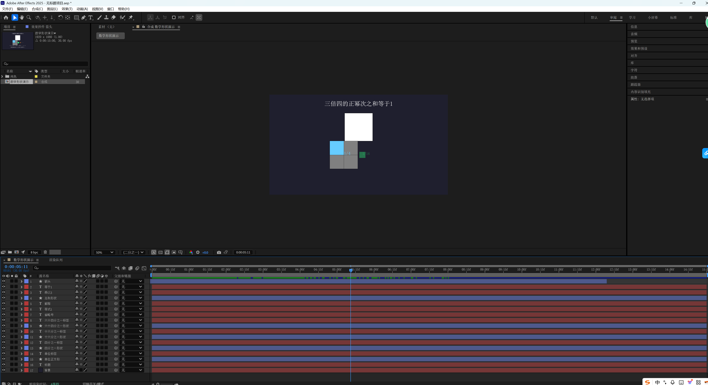
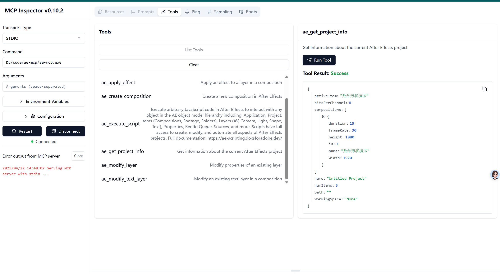
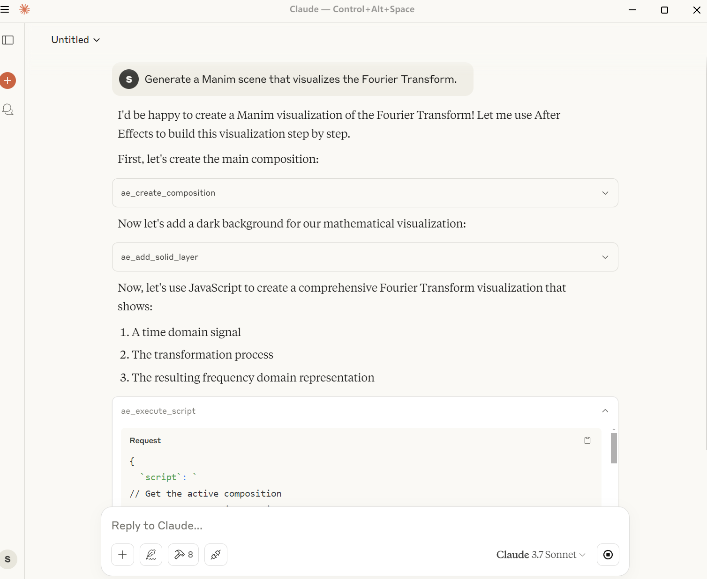

# After Effects MCP Integration 🚀


A powerful, extensible Model Context Protocol (MCP) integration for Adobe After Effects. This project enables AI assistants to directly interact with and control After Effects through a standardized interface.

## 📸 Screenshots

### After Effects Integration


### MCP Tool Inspector


### Claude Integration


## 🎬 Demo Video

Check out the demo video below to see the integration in action:

<!-- Method 3: HTML video tag (works in some markdown renderers) -->
<video src="https://github.com/sunqirui1987/ae-mcp/raw/main/docs/数学形状演示.mp4" controls="controls" style="max-width: 730px;">
</video>

## ✨ Features

- **Extensible Architecture**: Easily add new tools through configuration files
- **Rich After Effects Functionality**: Control compositions, layers, effects, and more
- **MCP Compliant**: Works with any MCP-compatible AI model, including Claude
- **Simple API**: Intuitive commands for AI control of After Effects

## 🛠️ Tools

This integration provides a comprehensive set of tools for After Effects:

| Category | Capabilities |
|----------|-------------|
| **Project Management** | Get project information, manage assets |
| **Compositions** | Create, query, and modify compositions |
| **Layers** | Add and modify layers (solids, text, shape, etc.) |
| **Effects** | Apply and manage effects with customizable parameters |
| **Animation** | Control keyframes and animation properties |

## 🚀 Getting Started

### Prerequisites

- Adobe After Effects (CC 2020 or later recommended)
- Go/Go+ runtime (for the MCP server)
- Basic knowledge of After Effects and MCP

### Installation

1. Clone this repository:
   ```bash
   git clone https://github.com/sunqirui1987/ae-mcp.git
   cd ae-mcp
   ```

2. Install dependencies:
   ```bash
   gop mod tidy
   gop build ./cmd/ae-mcp/
   ```

3. Install the After Effects ExtendScript:
   - Open After Effects
   - Go to File > Scripts > Run Script File...
   - Select the `js/ae-mcp.jsx` file

### Running the MCP Server

To use with Claude or other AI assistants, add the following MCP configuration:

```json
{
  "mcpServers": {
    "aftereffects": {
      "command": "/path/to/your/ae-mcp.exe",
      "args": []
    }
  }
}
```

> **Note:** Replace `/path/to/your/ae-mcp.exe` with the actual path to the ae-mcp executable on your system. For example, if you cloned the repository to `C:/projects/ae-mcp`, the path would be `C:/projects/ae-mcp/ae-mcp.exe`.

For Claude Desktop: Go to Claude > Settings > Developer > Edit Config and add the above configuration.

For Cursor: Go to Settings > MCP > Add Server to add the configuration.

The server will start and listen for connections from AI models.

## 🎬 Using with Claude

Once the MCP server is running and configured in Claude, you'll be able to interact with After Effects using natural language commands.

### Example Commands

Here are some examples of what you can ask Claude to do:

* "Create a new composition named 'Intro Animation' with 1920x1080 resolution"
* "Add a text layer with the message 'Welcome!' and center it"
* "Apply a fade-in effect to the text layer"
* "Create a simple logo animation with a bounce effect"
* "Add a solid layer and apply a particle effect to it"
* "Change the background color to a gradient from blue to purple"
* "Add camera movement that slowly zooms in on the text"
* "Export the composition as an MP4 file"

### Capabilities

* Get project and composition information
* Create and modify compositions
* Add and manipulate various layer types (text, solid, shape, etc.)
* Apply and customize effects
* Control animation and keyframes
* Manage project assets and media

## 🤝 Contributing

Contributions are welcome! Please feel free to submit a Pull Request.

## 📄 License

This project is licensed under the MIT License - see the LICENSE file for details.

## 📞 Support

For questions and support, please open an issue in the GitHub repository.
